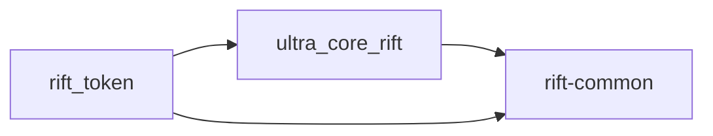

# Rift-Network

    

Rift-Network is an experimental Solana protocol implemented with Anchor. It combines a core accounting layer with a separate token issuance layer to preserve a strict mathematical invariant while offering RIFT SPL token minting.

The repository is built as an Anchor workspace with two programs:

- `ultra_core_rift`: the core economic state machine and invariant enforcement layer.
- `rift_token`: the token issuance layer that mints RIFT shares based on core state.
- `rift-common`: shared protocol constants and error definitions.

This README is based on the actual implementation in the repository and the protocol model defined in [SPEC.md](SPEC.md).

## Table of Contents

- [Overview](#overview)
- [Motivation](#motivation)
- [Architecture](#architecture)
- [Repository Structure](#repository-structure)
- [Economic Model](#economic-model)
- [Core Program](#core-program)
- [Token Program](#token-program)
- [Protocol Invariants](#protocol-invariants)
- [Implemented Functionality](#implemented-functionality)
- [Roadmap](#roadmap)
- [Build Instructions](#build-instructions)
- [Test Instructions](#test-instructions)
- [CI Description](#ci-description)
- [License](#license)

## Overview

Rift-Network is a research-oriented protocol that tracks participant balances with a shared scalar field and enforces supply accounting through an explicit economic invariant. The system separates the core mathematical state from the token layer so that the SPL token interface can read core state without modifying invariant logic directly.

## Motivation

The protocol is designed to explore a participant-based supply model that supports:

- uniform field-based balance shifts across all participants,
- controlled redistribution of supply,
- negative entropy decay,
- directed edge transfer costs,
- SPL token issuance tied to core economic state.

Separating the core accounting layer from the token layer improves safety by keeping critical invariant logic contained in a dedicated program while exposing an SPL token interface through a separate program.

## Architecture

Rift-Network uses an Anchor workspace with two programs and a shared common crate.

- `ultra_core_rift`: core accounting, participant state, and invariant enforcement.
- `rift_token`: token issuance, fee collection, and minting logic.
- `rift-common`: shared protocol constants and error definitions.

The core program owns the protocol state and executes invariant-preserving transitions. The token program reads core state and mints RIFT shares according to current field pressure.

### Diagram



## Repository Structure

```text
.
├── Anchor.toml
├── Cargo.toml
├── SPEC.md
├── crates/
│   └── rift-common/
│       └── src/lib.rs
├── programs/
│   ├── ultra_core_rift/
│   │   └── src/lib.rs
│   └── rift_token/
│       └── src/lib.rs
└── .github/workflows/
    └── rust.yml
```

## Economic Model

Rift-Network is based on the following protocol primitives:

- `p`: participant count.
- `base_balance`: signed participant balance stored in the core program.
- `global_field`: signed scalar field applied uniformly to all participants.
- `total_base_sum`: sum of all participant `base_balance` values.
- `total_supply`: unsigned protocol supply.
- `total_minted` and `total_burned`: cumulative mint and burn counters.
- `dust_accumulator`: redistribution remainder.

### Effective Balance

Each participant's effective balance is conceptually:

```text
effective_balance = base_balance + global_field
```

This means every participant is shifted by the same `global_field` amount in the economic model.

### Redistribution

The core program can redistribute supply by increasing `global_field` and minting the corresponding amount into `total_supply`. Redistribution splits the amount evenly across `p`, and any remainder is stored in `dust_accumulator`.

### Negative Entropy

Negative entropy decreases `global_field` by a fixed constant `NEG_E` and adjusts `total_base_sum` so the invariant remains valid.

### Edge Costs

Transfers may include a directed edge cost. The cost is applied to the sender in addition to the transfer amount:

- positive weight burns supply,
- negative weight mints supply,
- zero weight behaves as a normal transfer.

### Debt Limit

The protocol enforces a dynamic debt ceiling to bound negative participant balances. The debt limit is derived from current supply and participant count so that no participant can create unbounded debt.

## Core Program

`programs/ultra_core_rift` implements the protocol state machine and invariant logic.

### Core State

The program stores:

- `gate`: privileged authority key.
- `paused`: transfer pause flag.
- `global_field`: signed scalar field.
- `total_base_sum`: sum of base balances.
- `total_supply`: unsigned supply.
- `total_minted`: total minted amount.
- `total_burned`: total burned amount.
- `p`: participant count.
- `dust_accumulator`: redistribution remainder.

### Instructions

- `initialize(gate)`: create a new `CoreState`.
- `set_paused(paused)`: gate-only pause control.
- `register(user)`: gate-only participant registration; preserves the invariant by adjusting `total_base_sum`.
- `unregister()`: gate-only participant removal; disallows debt and burns any positive remaining balance.
- `transfer(amount)`: participant-to-participant transfer without edge cost.
- `transfer_with_edge(amount)`: transfer with a directed edge cost and explicit target authorization.
- `set_edge(_from, _to, weight)`: gate-only set or update an edge weight.
- `redistribute(amount)`: gate-only increase `global_field` and mint supply across participants.
- `apply_neg_entropy()`: gate-only apply a negative entropy tick and adjust `total_base_sum`.

### Accounts

- `CoreState`: global protocol state.
- `UserAccount`: per-participant account, PDA `['user', authority]`.
- `EdgeAccount`: directed edge weight, PDA `['edge', from, to]`.

## Token Program

`programs/rift_token` provides an SPL token layer on top of the core state.

### Token State

The token program stores:

- `authority`: gate authority for `rebase`.
- `core_state`: bound `CoreState` address.
- `admin_vault`: SOL fee recipient and founder share recipient.
- `decimals`: token decimal precision.
- `fee_bps`: issuance fee, capped at 10 basis points (0.10%).
- `total_shares`: minted RIFT shares.
- `rift_multiplier`: cached field multiplier.

### Instructions

- `initialize(decimals, fee_bps, initial_supply)`: create token state and mint 3.14% of `initial_supply` to the admin vault.
- `issue_rift(base_amount)`: user-facing mint function that accepts SOL, deducts the protocol fee, computes field pressure, and mints RIFT shares.
- `rebase()`: gate-only refresh the cached `rift_multiplier` from the current core `global_field`.

### Minting Logic

`issue_rift` computes RIFT shares as:

```text
field_pressure = max(|global_field|, MIN_FIELD_PRESSURE)
mint_multiplier = 1e15 / field_pressure
shares_to_mint = (base_amount - fee) * mint_multiplier / 1e12
```

A floor on `field_pressure` prevents the multiplier from diverging when `global_field` is close to zero.

### Security Checks

- verifies `core_state` against the stored bound address.
- verifies `admin_vault` against the stored admin vault.
- checks `core.paused` before minting.
- requires `shares_to_mint > 0`.

## Protocol Invariants

The implementation enforces the following invariant conditions:

- `total_supply = total_base_sum + global_field × p`
- `total_supply = total_minted − total_burned`
- `total_supply ≤ i128::MAX`
- `total_minted ≥ total_burned`
- if `p > 0`, `dust_accumulator < p`

The core program validates these conditions in `CoreState::check_invariant()` after every state-changing instruction.

## Implemented Functionality

The repository currently implements:

- core initialization and gate-authorized administration,
- participant registration and safe unregistering,
- participant transfers and edge-cost transfers,
- protocol redistribution and negative entropy ticks,
- SPL token issuance based on core field pressure,
- founder share minting and SOL fee collection,
- cached token multiplier updates via rebase.

## Roadmap

Future work includes:

- more extensive integration and invariant tests,
- formal verification of state transitions,
- improved Anchor deployment and upgrade tooling,
- off-chain tooling for monitoring and indexing state,
- governance and authority management solutions.

## Build Instructions

### Prerequisites

- Rust toolchain.
- Solana CLI.
- Anchor CLI.

### Build

```bash
cargo build --workspace
```

### Format

```bash
cargo fmt --all
```

### Lint

```bash
cargo clippy --workspace --exclude ultra_core_rift --exclude rift_token --all-targets --all-features -- -D warnings -A unexpected-cfgs
```

## Test Instructions

The current repository test workflow excludes the Anchor programs:

```bash
cargo test --workspace --exclude ultra_core_rift --exclude rift_token
```

## CI Description

The repository CI workflow is defined in `.github/workflows/rust.yml` and currently performs:

- checkout
- install Rust toolchain `1.85.1` with `rustfmt` and `clippy`
- cache Cargo registry and build artifacts
- `cargo fmt --all -- --check`
- `cargo clippy --workspace --exclude ultra_core_rift --exclude rift_token --all-targets --all-features -- -D warnings -A unexpected-cfgs`
- `cargo test --workspace --exclude ultra_core_rift --exclude rift_token`

## Security

Please report security issues privately by emailing the maintainers or opening a private report through the repository security contact. Do not disclose vulnerabilities publicly until a fix is available.

## License

This project is licensed under Business Source License 1.1 (BSL 1.1). The source code is provided for study and audit, while commercial and production deployment are restricted by the terms in `LICENSE`. See `LICENSE` and `NOTICE` for full legal guidance.
